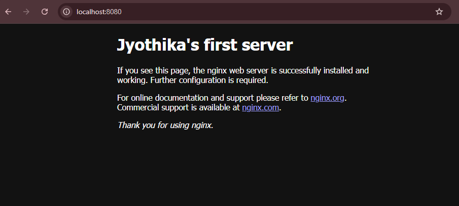
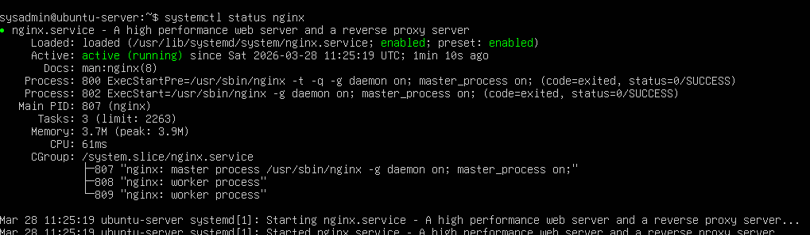

# Linux Server Nginx Lab

---

## Zusammenfassung (Deutsch)

Dieses Projekt dokumentiert den Aufbau eines Linux-Servers in einer VirtualBox-Umgebung sowie die Installation und Bereitstellung eines Nginx-Webservers. Ziel war es, grundlegende Konzepte der Systemadministration wie Benutzerverwaltung, Paketverwaltung, Services, Netzwerkkonfiguration und Port-Weiterleitung praktisch zu verstehen und anzuwenden.

---

## Overview

This project demonstrates the setup of an Ubuntu Server virtual machine using VirtualBox and the deployment of an Nginx web server. It focuses on building foundational system administration skills including Linux navigation, package management, service management, networking, and port forwarding.

---

## Architecture
```
Browser (Host Machine)
↓
localhost:8080
↓
VirtualBox Port Forwarding
↓
Ubuntu Server (VM)
↓
Nginx (Port 80)
```
---

## Technologies Used

* VirtualBox
* Ubuntu Server 24.04 LTS
* Nginx
* Linux CLI (Command Line Interface)
* VirtualBox NAT Networking
* Port Forwarding

---

## What I Practiced

* Creating and managing a virtual machine
* Installing Ubuntu Server
* Logging into a Linux system
* Updating system packages using `apt`
* Understanding user identity (`whoami`, `id`)
* Navigating the Linux filesystem (`pwd`, `ls`, `cd`)
* Creating and managing files
* Installing and managing services (Nginx)
* Checking service status using `systemctl`
* Identifying network interfaces using `ip a`
* Testing services using `curl`
* Configuring port forwarding in VirtualBox
* Accessing a web server from a browser

---

## Key Commands Used

sudo apt update
sudo apt upgrade
whoami
id
pwd
ls
mkdir practice
cd practice
touch notes.txt
cat notes.txt
echo "hello" > notes.text
sudo apt install nginx
systemctl status nginx
ip a
curl localhost

---

## Networking Explanation

The Nginx web server runs inside the Ubuntu virtual machine and listens on **port 80**, which is the default HTTP port.

Since the VM was configured using **NAT in VirtualBox**, direct access from the host machine is restricted.

To solve this, **port forwarding** was configured:

* Host Port: 8080
* Guest Port: 80

This means:

localhost:8080 (Host) → forwarded to → Port 80 (Ubuntu VM → Nginx)

As a result, the web server became accessible via:

http://localhost:8080

---

## Result

* Nginx was successfully installed and running
* The default web page was accessible using `curl localhost`
* The server was accessed from a browser via port forwarding
* The default Nginx page was modified to display custom content

---

## Challenges and Solutions

### 1. VM booted into installer again

Problem: After installation, the VM started the Ubuntu installer again.
Cause: The Ubuntu ISO file was still attached.
Solution: Removed the ISO so the VM booted from the installed disk.

---

### 2. Network interface confusion

Problem: It was unclear which IP address to use.
Solution: Used `ip a` to identify the active interface (`enp0s3`) and its IP.

---

### 3. Port access limitation (NAT)

Problem: Could not access the server directly using the VM IP.
Cause: VirtualBox NAT restrictions.
Solution: Configured port forwarding (8080 → 80).

---

### 4. Nano editing issue

Problem: Unable to type in `nano`.
Solution: Used:
echo "hello" > notes.text
cat notes.text

---

## What I Learned

* How a Linux server is installed and accessed
* How services like Nginx run in the background
* The role of ports in networking
* How virtualization affects networking
* Basic troubleshooting techniques
* Working with a system via CLI

---

## Next Improvements

* Configure firewall using UFW
* Explore logs (`/var/log`)
* Practice service troubleshooting
* Improve SSH usage
* Extend into a hybrid Windows + Linux lab

---

## Future Work

This project serves as a foundation for a larger setup:

Hybrid Home Lab:

* Windows Server (Active Directory + DNS)
* Windows Client (Domain joined)
* Ubuntu Server (Web server)

This will simulate a real enterprise environment.

## Screenshots

### Web Server Output in Browser


### Nginx Service Status

