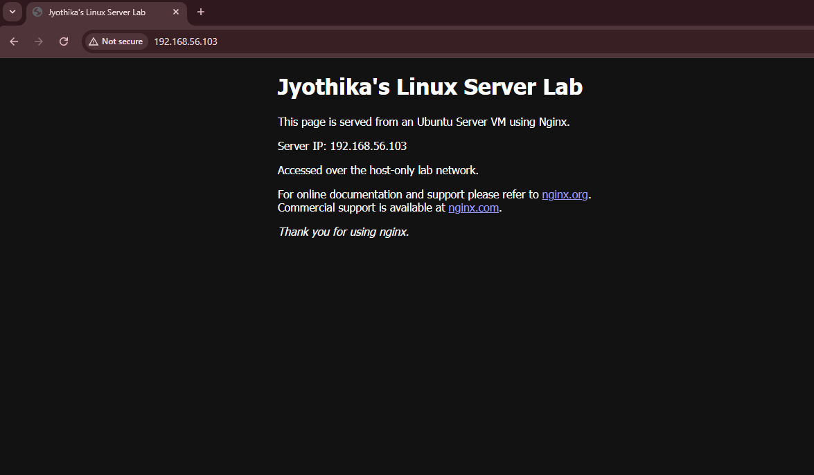
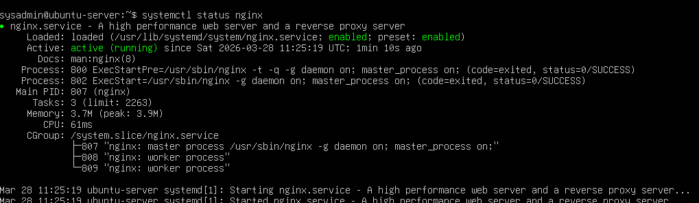

# Linux Server Nginx Lab

## Zusammenfassung (Deutsch)

In diesem Projekt wurde ein Ubuntu-Server in einer VirtualBox-Umgebung eingerichtet und als Webserver mit Nginx konfiguriert. Der Server wurde in ein internes Labornetzwerk integriert, mit einer statischen IP-Adresse versehen und über SSH administriert. Zusätzlich wurde eine Firewall (UFW) konfiguriert, um nur notwendige Dienste freizugeben. Ziel war es, grundlegende Konzepte der Linux-Systemadministration, Netzwerkkonfiguration und Serversicherheit praktisch umzusetzen.

---

## Overview

This project demonstrates the setup of an Ubuntu Server virtual machine and the deployment of an Nginx web server within a controlled lab network. The server was configured with a static IP address, accessed remotely via SSH, and secured using a firewall (UFW). The goal was to simulate real-world Linux system administration tasks including service management, networking, and basic security hardening.

---

## Lab Architecture

```text
Host Machine (Browser / SSH)
        |
        | 192.168.56.x Network
        |
Ubuntu Server (192.168.56.103)
        |
        | Port 80
        |
Nginx Web Server
```

---

## Technologies Used

- Ubuntu Server 24.04 LTS
- Nginx
- OpenSSH Server
- UFW (Uncomplicated Firewall)
- VirtualBox
- Linux CLI

---

## What I Built

- Installed Ubuntu Server in VirtualBox
- Configured networking using Host-only Adapter
- Assigned a static IP address (`192.168.56.103`)
- Enabled SSH for remote access
- Installed and configured Nginx
- Hosted a custom web page
- Configured firewall rules using UFW
- Verified connectivity and service availability

---

## Network Configuration

### Ubuntu Server

```text
Hostname: ubuntu-server
IP Address: 192.168.56.103
Subnet Mask: 255.255.255.0
Interface: enp0s3
```

---

## Verification Commands

### Check IP address

```bash
ip a
```

---

### Check Nginx status

```bash
systemctl status nginx
```

---

### Test web server locally

```bash
curl localhost
```

---

### Test SSH connection (from host)

```bash
ssh username@192.168.56.103
```

---

### Check firewall status

```bash
sudo ufw status
```

---

## Nginx Configuration

The default Nginx page was modified to display custom content:

```html
<h1>Jyothika's Linux Server Lab</h1>
<p>This web server is hosted on Ubuntu using Nginx.</p>
<p>Server IP: 192.168.56.103</p>
```

---

## Firewall Configuration (UFW)

The firewall was configured to allow only required services:

```text
22/tcp → SSH
80/tcp → HTTP
```

All other incoming connections are blocked by default.

---

## Result

- Nginx is running and accessible via browser
- Custom web page is successfully hosted
- Server is accessible via SSH from host machine
- Firewall is active and correctly configured

---

### Verification

```text
ip a → 192.168.56.103
systemctl status nginx → active (running)
sudo ufw status → active
```

---

## Troubleshooting

### 1. NAT Network Limitation

**Problem:** Server was not accessible from host using IP  
**Cause:** NAT network isolates VM  
**Solution:** Switched to Host-only Adapter (`192.168.56.x` network)

---

### 2. Dynamic IP Issue

**Problem:** IP address changed after reboot  
**Cause:** DHCP assignment  
**Solution:** Configured static IP using Netplan

---

### 3. SSH Authentication Error

**Problem:** Permission denied during login  
**Cause:** Incorrect username or password  
**Solution:** Verified username using `whoami` and retried login

---

### 4. Firewall Risk

**Problem:** Risk of locking out SSH  
**Solution:** Allowed SSH before enabling firewall

---

## What I Learned

- How to configure a Linux server in a virtual environment
- How SSH enables remote server administration
- How web servers (Nginx) serve content over HTTP
- Importance of static IP configuration for servers
- Basic firewall configuration and security principles
- Troubleshooting network and authentication issues

---

## Next Improvements

- Explore Nginx configuration (virtual hosts)
- Analyze logs (`/var/log/nginx/`)
- Configure HTTPS using SSL
- Integrate Linux server into Active Directory lab
- Automate setup using shell scripts

---

## Key Takeaways

- Servers should use static IP addresses for stability
- SSH enables secure remote management of systems
- Firewalls should allow only necessary services
- Nginx serves content from defined directories over HTTP
- Network configuration plays a critical role in accessibility

---

## Screenshots

### Custom Web Page



---

### Nginx Service Status



---

### Firewall Status


